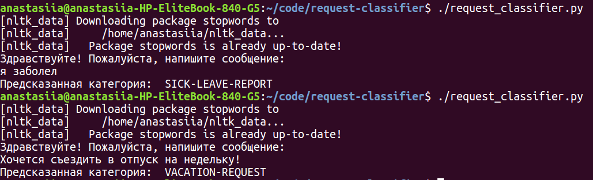

# request-classifier

## Repository organisation

* Classifier code: [request_classifier.py](request_classifier.py)
* Model training process: [fasttext_training.ipynb](fasttext_training.ipynb)
* Training and test datasets: [data](data/)
* Saved trained model: [trained_model](trained_model/)

## How to run the code

Чтобы запустить классификатор текстов:

1. установите Python3, nltk, fasstext, pymystem3
2. скачайте репозиторий
3. откройте терминал и перейдите в папку request-classifier
4. запустить классификатор с помощью команды ./request_classifier.py

## Example

Пример работы классификатора:

